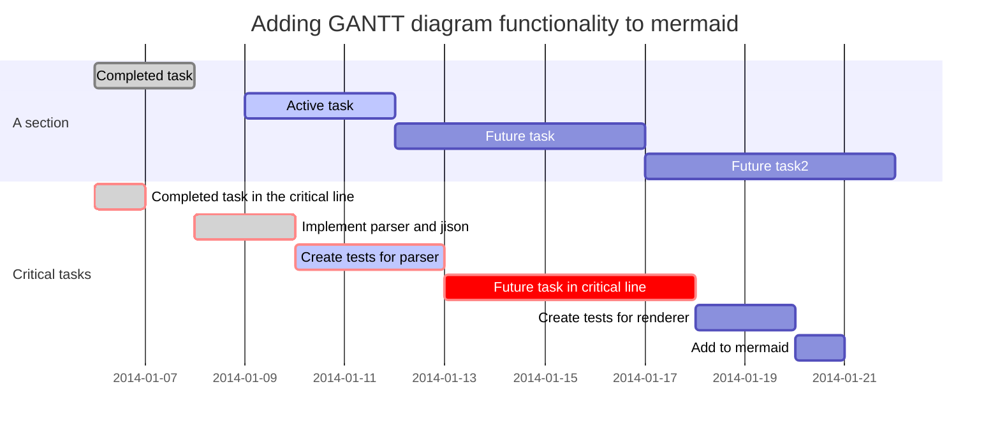

# Repository Template

Dieses Repository dient als beispielhafte Vorlage für das Capstone Project Information Systems der Universität zu Köln.

Das Repository bilded einen Scrum-Workflow innerhalb von GitHub ab. Dieser beinhaltet ein Kanban-Board für das Backlog, spezifizierte Labels für Prioritäten, Storypoints, etc., und beispielhafte Backlog-Items.

## Verwendung des Templates

- Specify the .gitignore file depending on your technology stack

### Labels

Das Repository beinhaltet bereits vordefinierte Labels für Prioritäten, Storypoints (1-40), sowie die Typen Features, Bugs, und Tests.

Jedes Backlog-Item sollte entsprechend mindestens mit einem Storypoints-, Prioritäts-, und Typen-Label markiert werden.

Je nach Bedarf, können auch weitere Labels erstellt werden.

### Backlog

- Bei Bedarf auch weitere Boards möglich

## Repository Struktur

`docs`: Hier können Abgaben oder andere Dokumente, die im Verlauf des Capstone Projects erstellt werden, abgelegt werden.

## Velocity

| Sprints | Planned | Achieved |
|:-------:|:-------:|:--------:|
|    1    |         |          |
|    2    |         |          |
|    3    |         |          |
|    4    |         |          |
|    5    |         |          |

## Project Planning

<!-- Insert image -->

## Issue Template

## Description

As a user, I want to be able to log-in to the system to access my personal information.

## Acceptance Criteria

- The user is logged in if the entered e-mail matches the entered password
- The system informs the user if the login succeeds / fails

## Tasks

- [ ] Build log-in form
- [ ] Implement back-end function to check input
- [ ] Test with correct and incorrect inputs
