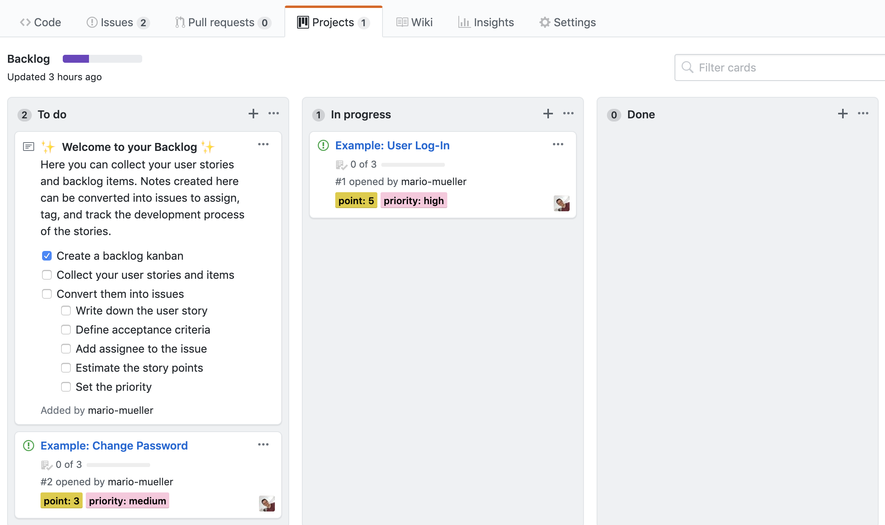
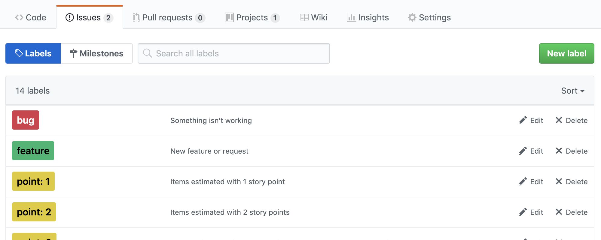
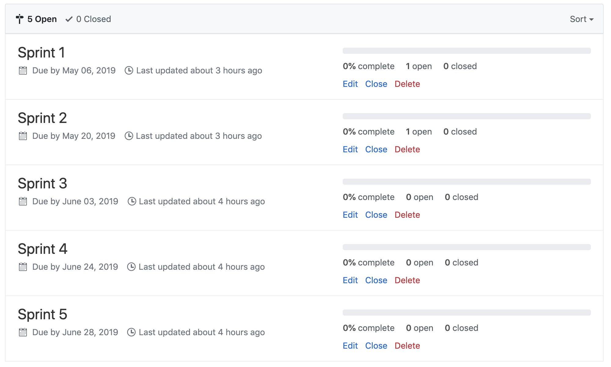

# Repository Template

Dieses Repository dient als beispielhafte Vorlage für das Capstone Project Information Systems der Universität zu Köln.

Das Repository bilded einen Scrum-Workflow innerhalb von GitHub ab. Dieser beinhaltet ein Kanban-Board für das Backlog, spezifizierte Labels für Prioritäten, Storypoints, etc., und beispielhafte Backlog-Items.

## Verwendung des Templates

### Backlog

Für das Backlog wurde bereits ein Kanban-Board angelegt, welches unter dem Reiter 'Projects/Projekte' zu erreichen ist.

Bei Bedarf können natürlich auch weitere Kanban-Boards angelegt werden, z. B. pro Sprint, bzw. das bestehende Board um weitere Spalten erweitert werden (z. B. "In Review").

### Labels

Das Repository beinhaltet bereits vordefinierte Labels für Prioritäten, Storypoints (1-40), sowie die Typen Features, Bugs, und Tests.

Jedes Backlog-Item sollte entsprechend mindestens mit einem Storypoints-, Prioritäts-, und Typen-Label markiert werden.

Je nach Bedarf, können auch weitere Labels erstellt werden.

### Milestones

Zusätzlich zu den Labels können die jeweiligen Backlog-Items sogenannten Milestones hinzugefügt werden. In diesem Template wurde für jeden Sprint ein Milestone definiert.

Durch die Zuordnung der Backlog-Items zu den jeweiligen Milestones, lassen sich die einzelnen Sprints besser planen.

## Repository Best Practices

- Es sollten keine direkten Commits auf den `master`-Branch erlaubt sein; dies kann in den Einstellungen des Repositories festgelegt werden
- Geheime Daten, wie Passwörter, Schlüssel, o.ä., sollten nicht im Quellcode auftauchen
- Abhängigkeiten des Projekts (z. B. Node-Module, o.ä.) sollten nicht in das Projekt commited werden; siehe Hinweise in der `.gitignore`'`
- Es sollte eine passende und ausreichend kommentierte `.gitignore` für das Projekt erstellt werden

### Branch Protection für Master-Branch

Die `master` Branch sollte immer potentiell deployable sein. Somit sollte es nicht möglich sein, direkt auf den `master` zu commiten, sondern dies mit Pull Requests zu realisieren.

## Projektplanung

### Velocity

Zur besseren Einsicht in den Fortschritt des Projekts, kann die Velocity über die Sprints direkt in der `README`-Datei vermerkt werden. Entsprechende Charts können ebenfalls eingefügt werden.

| Sprints | Planned | Achieved |
|:-------:|:-------:|:--------:|
|    1    |         |          |
|    2    |         |          |
|    3    |         |          |
|    4    |         |          |
|    5    |         |          |

## Struktur des Repositories

Das Repository sollte über eine klare Ornderstruktur verfügen. Hier ist eine mögliche Struktur exemplarisch vorgegeben. Je nach verwendeter Technolgie, können sich die Vorgaben von diesem Beispiel unterscheiden und sollten entsprechend verfolgt werden.

    .
    ├── build/                   # Kompilierte Dateien (alternativ `dist`)
    ├── docs/                    # Dokumente und Abgaben (alternativ `doc`)
    ├── src/                     # Quellcode Dateien (alternativ `app`)
    ├── tests/                   # Automatisierte Tests (alternativ `tests`)
    ├── LICENSE
    └── README.md
    └── .gitignore

Die Verwendung von Kleinbuchstaben zu Beginn von Ordner- und Dateinnamen wird empfohlen; zumindest auf der obersten Hierarchie-Ebene.
